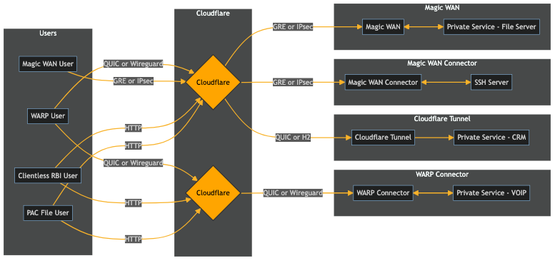

# How to: Get Up and Running with Magic WAN (+ its interops)
## Table of Contents
- [Step 1: Conduit Configuration](#step-1-conduit-configuration)
- [Step 2: GRE or IPsec Tunnel Prequisites](#step-2-gre-andor-ipsec-tunnel-prerequisites)
- [Step 3: Configure your tunnels and static routes on CLoudflare](#step-3-configure-your-tunnels-and-static-routes-on-cloudflare)
- [Step 4: Make sure health-checks work](#step-4-make-sure-health-checks-work)
- [Step 5: Router the private subnets to your vti](#step-5-route-the-private-subnets-to-your-vti)
- [Step 6: Automate your provisioning through the use of Gitops/IaC](#step-6-automate-your-provisioning-through-the-use-of-gitopsiac)
  - [GRE Tunnels](#gre-tunnels)
  - [IPsec Tunnels](#ipsec-tunnels)
  - [Static Routes](#static-routes)
  - [Magic Firewall](#magic-firewall)
- [Step 7: Interoperability (Optional)](#step-7-interoperability-optional)
  - [PAC File (Proxy Endpoints)](#pac-file-proxy-endpoints)
    - [PAC File Worker Deployment](#pac-file-worker-deployment)
    - [Gitops/IaC](#gitopsiac)
  - [WARP/Clientless RBI](#warpclientless-rbi)
    - [Gitops/IaC](#gitopsiac-1)
  - [Cloudflare Tunnel](#cloudflare-tunnel)
    - [Gitops/IaC](#gitopsiac-2)

### Step 1: Conduit Configuration
This would be setup during the onboarding with Cloudflare, the setup would require specific information from your end w.r.t specific subnets that should be upgraded or if you want to use non RFC 1918 prefixes.

### Step 2: GRE and/or IPsec Tunnel Prerequisites
B:th GRE and IPsec would add on top of the raw TCP packet, assuming MTU size being 1500 (this can be lower depending on your internet breakouts, KPN and Deutsch Telecom for instance would already need TCP clamping), the MSS would be lower:

For GRE:

| Standard Internet Routable MTU | 1500 bytes |
|--------------------------------|------------|
|- Original IP header            |  20 bytes  |
|- Original protocol header (TCP)|  20 bytes  |
|- New IP header                 |  20 bytes  |
|- New protocol header (GRE)     |  4 bytes   |
|= Maximum segment size (MSS)    |  1436 bytes|

For IPsec this value would be lower still, depending on if it's IPsec within GRE or on its own. The `ESP` header would be `8 bytes`, `ESP Trailer` could be `16 to 20 bytes` conservatively.

In my case the end value is `1350`.

You can check by running this command:

```sh
sudo tcpdump -i [INTERFACE] 'tcp[tcpflags] & (tcp-syn)!=0 and dst port [443 or 80]
```
An example would look like this for the internet breakout:

```sh
09:47:29.132309 IP [MY_IP].fixed.kpn.net.53958 > 162.159.138.105.https: Flags [S], seq 471050517, win 64240, options [mss 1452,nop,wscale 8,nop,nop,sackOK], length 0
```

With IPsec, `10.68.100.20` is the tunnel endpoint on my side of the tunnel:

```sh
09:49:19.268016 IP 10.68.100.20.51678 > 104.16.236.133.https: Flags [S], seq 2995991175, win 32120, options [mss 1350,sackOK,TS val 1792385600 ecr 0,nop,wscale 7], length 0:
```

### Step 3: Configure your [tunnels](https://developers.cloudflare.com/magic-wan/configuration/manually/how-to/configure-tunnels/) and [static routes](https://developers.cloudflare.com/magic-wan/configuration/manually/how-to/configure-static-routes/) on Cloudflare

- Create a [vti](https://docs.strongswan.org/docs/5.9/features/routeBasedVpn.html#XFRM-Interfaces-on-Linux) with a /31 subnet for use, refer to your vendor documentation on how to create one
- The Cloudflare endpoint will be provided to you via the conduit configuration yaml
- The Customer endpoint would be the IP provided to you via your ISP
- By default, you can only add [static routes](https://developers.cloudflare.com/magic-wan/configuration/manually/how-to/configure-static-routes/) with  [RFC 1918](https://datatracker.ietf.org/doc/html/rfc1918) IP prefixes like:
  - 10.0.0.0/8
  - 172.16.0.0/12
  - 192.168.0.0/16

There are exceptions for publicly routable addresses, inform your friendly (at this point) implementation manager before the project begins.

### Step 4: Make sure [health-checks](https://developers.cloudflare.com/magic-wan/configuration/manually/how-to/tunnel-health-checks/) work
You should start seeing Cloudflare's side of the tunnel hitting yours (health wise, take an average as not all data centers pinging your end of the tunnel matters):
```sh
10:05:07.160315 IP 10.68.100.21 > 10.68.100.20: ICMP echo request, id 7295, seq 0, length 64
10:05:07.160378 IP 10.68.100.20 > 10.68.100.21: ICMP echo reply, id 7295, seq 0, length 64
10:05:07.169088 IP 10.68.100.21 > 10.68.100.20: ICMP echo request, id 63043, seq 0, length 64
10:05:07.169150 IP 10.68.100.20 > 10.68.100.21: ICMP echo reply, id 63043, seq 0, length 64
10:05:07.208415 IP 10.68.100.21 > 10.68.100.20: ICMP echo request, id 41057, seq 0, length 64
10:05:07.208498 IP 10.68.100.20 > 10.68.100.21: ICMP echo reply, id 41057, seq 0, length 64
10:05:07.238198 IP 10.68.100.21 > 10.68.100.20: ICMP echo request, id 17771, seq 0, length 64
```

### Step 5: Route the private subnets to your `vti`
> [!NOTE] Check your `sysctl` configuration for linux kernels
> It is possible that you might need to set these values:
> ```sh
> sudo sysctl -w net.ipv4.conf.all.accept_local=1
> sudo sysctl -w net.ipv4.conf.all.rp_filter=0
> ```
> `For rp_filter`
> 
> 0 - No source validation.
>
> 1 - Strict mode as defined in RFC3704 Strict Reverse Path Each incoming packet is tested against the FIB and if the interface is not the best reverse path the packet check will fail. By default failed packets are discarded.
>
> 2 - Loose mode as defined in RFC3704 Loose Reverse Path Each incoming packet’s source address is also tested against the FIB and if the source address is not reachable via any interface the packet check will fail.
> Current recommended practice in RFC3704 is to enable strict mode to prevent IP spoofing from DDos attacks. **If using asymmetric routing or other complicated routing, then loose mode is recommended.**

Consult your vendor documentation, here are some examples:

- [Alibaba Cloud VPN Gateway](https://developers.cloudflare.com/magic-wan/configuration/manually/third-party/alibaba-cloud/)
- [Amazon AWS Transit Gateway](https://developers.cloudflare.com/magic-wan/configuration/manually/third-party/aws/)
- [Aruba EdgeConnect Enterprise](https://developers.cloudflare.com/magic-wan/configuration/manually/third-party/aruba-edgeconnect/)
- [Cisco IOS XE](https://developers.cloudflare.com/magic-wan/configuration/manually/third-party/cisco-ios-xe/)
- [Cisco SD-WAN](https://developers.cloudflare.com/magic-wan/configuration/manually/third-party/viptela/)
- [Fortinet](https://developers.cloudflare.com/magic-wan/configuration/manually/third-party/fortinet/)
- [Furukawa Electric FITELnet](https://developers.cloudflare.com/magic-wan/configuration/manually/third-party/fitelnet/)
- [Google Cloud VPN](https://developers.cloudflare.com/magic-wan/configuration/manually/third-party/google/)
- [Microsoft Azure](https://developers.cloudflare.com/magic-wan/configuration/manually/third-party/azure/)
- [Palo Alto Networks NGFW](https://developers.cloudflare.com/magic-wan/configuration/manually/third-party/palo-alto/)
- [pfSense](https://developers.cloudflare.com/magic-wan/configuration/manually/third-party/pfsense/)
- [SonicWall](https://developers.cloudflare.com/magic-wan/configuration/manually/third-party/sonicwall/)
- [Sophos Firewall](https://developers.cloudflare.com/magic-wan/configuration/manually/third-party/sophos-firewall/)
- [strongSwan](https://developers.cloudflare.com/magic-wan/configuration/manually/third-party/strongswan/)
- [VyOS](https://developers.cloudflare.com/magic-wan/configuration/manually/third-party/vyos/)

You can do a TCP `traceroute`  to see if it's going via the tunnel to another endpoint that's also exposed via Magic WAN:
```sh
sudo traceroute -T 172.18.0.8
traceroute to 172.18.0.8 (172.18.0.8), 30 hops max, 60 byte packets
 1  10.68.69.1 (10.68.69.1)  0.627 ms  0.460 ms  0.480 ms
 2  10.68.100.21 (10.68.100.21)  5.833 ms  5.289 ms  5.264 ms
 3  172.71.93.32 (172.71.93.32)  7.644 ms  7.038 ms  10.645 ms
 4  172.18.0.8 (172.18.0.8)  10.356 ms  10.562 ms  10.244 ms
```

### Step 6: Automate your provisioning through the use of Gitops/IaC
This can be done via the UI, API or via Terraform. However, it is recommended to use infrastructure as code as much as possible. The examples make use of [`.tfvars`](https://developer.hashicorp.com/terraform/language/values/variables#variable-definitions-tfvars-files) file and a [`variables.tf`](https://developer.hashicorp.com/terraform/language/values/variables#declaring-an-input-variable) file to reference those sensitive values when applying or planning the infrastructure with Terraform. There are many ways to go about securing the sensitive information including the `.tfstate` file such as encrypting with [`Mozilla SOPS`](https://github.com/getsops/sops) and [`Age`](https://github.com/FiloSottile/age).

#### GRE Tunnels
```terraform
resource "cloudflare_gre_tunnel" "vyos_sg" {
  account_id              = var.cloudflare_account_id
  name                    = "vyos_sg"
  customer_gre_endpoint   = var.sg_ip
  cloudflare_gre_endpoint = var.wan_ip_1  # This will be provided to you during onboarding
  interface_address       = "10.68.88.21/31"
  description             = "vyos_sg_gre"
  ttl                     = 64
  mtu                     = 1476
  health_check_enabled    = true
  health_check_target     = var.sg_ip
  health_check_type       = "request"
}
```
#### IPsec Tunnels
```terraform
resource "cloudflare_ipsec_tunnel" "vyos_sg_ipsec" {
  account_id           = var.cloudflare_account_id
  name                 = "vyos_sg_ipsec"
  customer_endpoint    = var.sg_ip
  cloudflare_endpoint  = var.wan_ip_2
  interface_address    = "10.68.77.21/31"
  description          = "vyos_sg_ipsec_m1"
  health_check_enabled = true
  health_check_target  = var.sg_ip
  health_check_type    = "request"
  psk                  = var.psk_sg
  allow_null_cipher    = false
  hex_id               = var.hex_id_sg
  fqdn_id              = var.fqdn_id_sg
  user_id              = var.user_id_sg
}
```
#### Static Routes
```terraform
The `next-hop` address would be Cloudflare's side of the tunnel
resource "cloudflare_static_route" "eth1_vyos_nl_ipsec" {
  account_id  = var.cloudflare_account_id
  description = "ETH1"
  prefix      = "10.68.69.0/24"
  nexthop     = "10.68.100.20"
  priority    = 100
}
resource "cloudflare_static_route" "eth1_100_vyos_nl_ipsec" {
  account_id  = var.cloudflare_account_id
  description = "VLAN_100"
  prefix      = "10.68.70.0/24"
  nexthop     = "10.68.100.20"
  priority    = 100
}
 
resource "cloudflare_static_route" "podman_vyos_nl_ipsec" {
  account_id  = var.cloudflare_account_id
  description = "Podman"
  prefix      = "172.18.0.0/16"
  nexthop     = "10.68.100.20"
  priority    = 100
}
```
#### Magic Firewall
Refer also to [example rulesets](https://developers.cloudflare.com/magic-firewall/best-practices/)) based on common attack vectors
```terraform
resource "cloudflare_magic_firewall_ruleset" "magic_firewall" {
  account_id  = var.cloudflare_account_id
  name        = "Magic WAN Firewall"
  description = "Default Magic WAN Firewall"
 
  rules = [
    {
      action      = "allow"
      expression  = "(ip.proto eq \"icmp\")"
      description = "Allow ICMP"
      enabled     = "true"
    },
    {
      action      = "allow"
      expression  = "(ip.src in {100.64.0.0/10})"
      description = "Allow WARP Virtual IPs"
      enabled     = "true"
    }
  ]
}
```
### Step 7: Interoperability (Optional)
> [!NOTE] **Be aware of these limitations**
>
> **Virtual Networks**
> - Ensure Cloudflare Tunnel and WARP are on the default network for the interoperability to function
>
> **DH Group for IPsec Tunnels**
> - Cloudflare supports DH groups 20, 14, 5, but only one should be used when creating tunnels
>
> **WARP w/ Magic WAN**
> - Ensure WARP connectivity in locations whereby connectivity is routed to Cloudflare Gateway via Magic WAN to be excluded. This is due to the double encapsulation, once by WARP, and again via Magic WAN. Routing policies can be used to exclude connections to the [WARP Ingress IPs](https://developers.cloudflare.com/cloudflare-one/connections/connect-devices/warp/deployment/firewall/#warp-ingress-ip) and [WARP UDP Ports](https://developers.cloudflare.com/cloudflare-one/connections/connect-devices/warp/deployment/firewall/#warp-udp-ports)
>
> **Cloudflare Tunnel w/ Magic WAN**
> - Cloudflare Tunnel does not support outbound connections. Overlapping routes between Cloudflare Tunnel and Magic WAN will cause issues with outbound connections since Cloudflare Tunnel routes are prioritized over Magic WAN static routes
>
> **WARP Connector w/ Magic WAN**
> - The WARP Connector solves the bi-directional use case that Cloudflare Tunnel doesn't solve, however at this point, does not work with Magic WAN when configured within the same Cloudflare account/organisation (as the conduit configuration is tied to the account), and should be used as an alternative (as there are overlapping use cases) if the traditional approach via Magic WAN does not suit your current infrastructure.

[^1]

[^1]: The arrows signify bidirectional connections or unidirectional

#### PAC File (Proxy Endpoints)
There are many ways to deploy the PAC file such as MDMs and using a remote server, in this case, I'll be using [Workers](https://github.com/erfianugrah/worker-proxy-pac). You can follow the steps [here](https://developers.cloudflare.com/cloudflare-one/connections/connect-devices/agentless/pac-files/), when using the code, you can create more cases to match specific files, in my case it is nl.pac  and sg.pac  to simulate the two locations, I also used [Workers Secrets](https://developers.cloudflare.com/workers/configuration/secrets/) to store the Proxy Endpoint domains:

##### PAC File Worker Deployment
###### Worker entrypoint (index.js)
```js
import { nl_pac_file, sg_pac_file } from "./pac_file.js";
 
export default {
  fetch(request, env) {
    const url = new URL(request.url);
 
    if (url.pathname === "/nl.pac") {
      return nl_pac_file(env);
    } else if (url.pathname === "/sg.pac") {
      return sg_pac_file(env);
    } else {
      return new Response("Not Found", { status: 404 });
    }
  },
};
```
###### PAC File variables (pac_file.js)
```js
export function nl_pac_file(env) {
  const nl = `
function FindProxyForURL(url, host) {
// No proxy for private (RFC 1918) IP addresses (intranet sites)
  // if (
  //   isInNet(dnsResolve(host), "10.0.0.0", "255.0.0.0") ||
  //   isInNet(dnsResolve(host), "172.16.0.0", "255.240.0.0") ||
  //   isInNet(dnsResolve(host), "192.168.0.0", "255.255.0.0")
  // ) {
  //   return "DIRECT";
  // }
 
  // No proxy for localhost
  // if (isInNet(dnsResolve(host), "127.0.0.0", "255.0.0.0")) {
  //   return "DIRECT";
  // }
  // Example logic to determine whether to use a proxy
  return "HTTPS ${env.NL_DOMAIN}.proxy.cloudflare-gateway.com:443";
}
`;
  // Set headers to prevent caching
  const headers = new Headers({
    "Content-Type": "application/x-ns-proxy-auto-config",
    "Cache-Control": "no-store, max-age=0",
  });
 
  return new Response(nl, { headers: headers });
}
 
export function sg_pac_file(env) {
  const sg = `
function FindProxyForURL(url, host) {
// No proxy for private (RFC 1918) IP addresses (intranet sites)
  // if (
  //   isInNet(dnsResolve(host), "10.0.0.0", "255.0.0.0") ||
  //   isInNet(dnsResolve(host), "172.16.0.0", "255.240.0.0") ||
  //   isInNet(dnsResolve(host), "192.168.0.0", "255.255.0.0")
  // ) {
  //   return "DIRECT";
  // }
 
  // No proxy for localhost
  // if (isInNet(dnsResolve(host), "127.0.0.0", "255.0.0.0")) {
  //   return "DIRECT";
  // }
  // Example logic to determine whether to use a proxy
  return "HTTPS ${env.SG_DOMAIN}.proxy.cloudflare-gateway.com:443";
}
`;
  // Set headers to prevent caching
  const headers = new Headers({
    "Content-Type": "application/x-ns-proxy-auto-config",
    "Cache-Control": "no-store, max-age=0",
  });
 
  return new Response(sg, { headers: headers });
}
```
###### wrangler.toml
```toml
name = "worker-proxy-pac"
main = "src/index.js"
compatibility_date = "2024-05-12"
compatibility_flags = ["nodejs_compat"]
 
[dev]
port = 9001
local_protocol="http"
upstream_protocol="https"
 
[env.staging]
name = "staging-pac"
vars = { ENVIRONMENT = "staging" }
workers_dev = true
 
[env.prod]
name = "prod-pac"
vars = { ENVIRONMENT = "production" }
routes = [
    { pattern = "proxy.{DOMAIN}.com", custom_domain = true },
]
# Secrets
# NL_DOMAIN
# SG_DOMAIN
```
##### Gitops/IaC
###### Proxy Endpoints HCL
```terraform
resource "cloudflare_teams_proxy_endpoint" "nl_proxy_endpoint" {
  account_id = var.cloudflare_account_id
  name       = "nl"
  ips        = ["${var.nl_ip}/32"]
}
 
resource "cloudflare_teams_proxy_endpoint" "sg_proxy_endpoint" {
  account_id = var.cloudflare_account_id
  name       = "sg"
  ips        = ["${var.sg_ip}/32"]
}
```

#### WARP/Clientless RBI
With WARP, the [managed](https://developers.cloudflare.com/cloudflare-one/connections/connect-devices/warp/deployment/mdm-deployment/) deployment approach is recommended as you can ensure that not only you're managing the devices and the policies but also the WARP client itself. This can also be managed through the use of [Device Profiles](https://developers.cloudflare.com/cloudflare-one/connections/connect-devices/warp/configure-warp/device-profiles/). If the use case is to connect to endpoints behind Cloudflare Tunnel or Magic WAN, select the `default` [Virtual Network](https://developers.cloudflare.com/cloudflare-one/connections/connect-networks/private-net/cloudflared/tunnel-virtual-networks/) in the client's dropdown menu.

Both WARP (you can also isolate applications) and [Clientless RBI](https://developers.cloudflare.com/cloudflare-one/policies/browser-isolation/setup/clientless-browser-isolation/#clientless-web-isolation) would use the same Access application and policy as shown below, and both would allow the user to access private IP applications via the other on-ramps.

##### Gitops/Iac
###### WARP/RBI Access Policy HCL
```terraform
resource "cloudflare_access_policy" "warp_login" {
  account_id       = var.cloudflare_account_id
  name             = "Allow Erfi"
  decision         = "allow"
  session_duration = "30m"
 
  include {
    group = [cloudflare_access_group.erfi_corp.id]
  }
}
```
###### WARP/RBI Access App HCL
```terraform
resource "cloudflare_access_application" "warp_login" {
  account_id = var.cloudflare_account_id
  policies = [
    cloudflare_access_policy.warp_login.id
  ]
  allowed_idps = [
    cloudflare_access_identity_provider.entra_id.id,
    cloudflare_access_identity_provider.google_workspace.id,
    cloudflare_access_identity_provider.gmail.id,
    cloudflare_access_identity_provider.keycloak_oidc.id,
    cloudflare_access_identity_provider.authentik_oidc.id,
    cloudflare_access_identity_provider.authentik_saml.id,
    cloudflare_access_identity_provider.otp.id
  ]
  auto_redirect_to_identity = false
  domain                    = "erfianugrah.cloudflareaccess.com/warp"
  name                      = "Warp Login App"
  session_duration          = "24h"
  type                      = "warp"
}
```
###### Virtual Networks HCL
```terraform
resource "cloudflare_tunnel_virtual_network" "vyos_nl" {
  account_id = var.cloudflare_account_id
  name       = "vyos_nl_vnet"
  is_default_network = true
}
```
###### Device Settings Policy HCL
```terraform
resource "cloudflare_device_settings_policy" "default" {
  account_id            = var.cloudflare_account_id
  name                  = "default"
  description           = "default_policy"
  # precedence            = 100
  # match                 = "any(identity.groups.name[*] in {\"Erfi Corp\"})"
  default               = true
  enabled               = true
  allow_mode_switch     = true
  allow_updates         = true
  allowed_to_leave      = true
  auto_connect          = 0
  captive_portal        = 180
  disable_auto_fallback = false
  switch_locked         = false
  service_mode_v2_mode  = "warp"
  service_mode_v2_port  = 3000
  exclude_office_ips    = true
}
 
resource "cloudflare_device_settings_policy" "google" {
  account_id            = var.cloudflare_account_id
  name                  = "Google Workspace"
  description           = "google_workspace_policy"
  precedence            = 200
  match                 = "any(identity.groups.name[*] in {\"Erfi Corp\"})"
  default               = false
  enabled               = true
  allow_mode_switch     = true
  allow_updates         = true
  allowed_to_leave      = true
  auto_connect          = 0
  captive_portal        = 180
  disable_auto_fallback = false
  switch_locked         = false
  service_mode_v2_mode  = "warp"
  service_mode_v2_port  = 3000
  exclude_office_ips    = true
}
```
#### Cloudflare Tunnel
Tunnels are used to exposed private applications or for connectivity in the case of RDP, SSH, VNC and the like, it does not support bi-directional traffic as mentioned above. By setting up the routes, you can now reach those same private applications behind Cloudflare Tunnel be it from a PAC file, clientless RBI, WARP or behind Magic WAN.

> [!NOTE] **Cloudflare Tunnel Deployment**
>
> There are (again) like WARP many ways to deploy, as systemd on a VM or metal, docker standalone or in compose or a deployment in k8s or docker swarm.
> 
> Be aware of the system requirements:
> 
> For most use cases, we recommend the following baseline configuration:
> 
> - Run a cloudflared replica on two dedicated host machines per network location. Using two hosts enables server-side redundancy and traffic balancing.
> - Size each host with minimum 4GB of RAM and 4 CPU cores.
> - Allocate 50,000 ports to the cloudflared process on each host.
>
> This setup is usually sufficient to handle traffic from 8,000 WARP users (4,000 per host). The actual amount of resources used by cloudflared will depend on many variables, including the number of requests per second, bandwidth, network path and hardware. As additional users are onboarded, or if network traffic increases beyond your existing tunnel capacity, you can scale your tunnel by adding an additional cloudflared host in that location.

##### Gitops/IaC
###### Terraform provider HCL with random provider
```terraform
terraform {
  required_providers {
    cloudflare = {
      source  = "cloudflare/cloudflare"
      version = "~> 4.0"
    }
    random = {
      source  = "hashicorp/random"
      version = "~> 3.0"
    }
  }
}
```
###### Use the random provider to generate string that will be use to set the tunnel secret
```terraform
# Generate a random string
resource "random_string" "tunnel_secret" {
  length  = 32
  special = false
}
```
###### Use the random string as the tunnel secret to create the Cloudflare Tunnel
```terraform
resource "cloudflare_tunnel" "vyos_nl" {
  account_id = var.cloudflare_account_id
  name       = "vyos_nl"
  secret     = base64encode(random_string.tunnel_secret.result)
  config_src = "cloudflare"
}
```
> [!NOTE] There be dragons
>
> Again, be aware of conflicting routes between Cloudflare Tunnel and Magic WAN

###### Tunnel Route HCL
```terraform
resource "cloudflare_tunnel_route" "vyos_nl" {
  account_id         = var.cloudflare_account_id
  tunnel_id          = cloudflare_tunnel.vyos_nl.id
  network            = "0.0.0.0/0"
  virtual_network_id = cloudflare_tunnel_virtual_network.vyos_nl.id
}
```
###### Tunnel Config HCL
```terraform
resource "cloudflare_tunnel_config" "vyos_nl" {
  account_id = var.cloudflare_account_id
  tunnel_id  = cloudflare_tunnel.vyos_nl.id
 
  config {
    warp_routing {
      enabled = true
    }
    ingress_rule {
      hostname = "prom-tunnel-nl.${var.domain_name}"
      service  = "http://localhost:11000"
    }
    ingress_rule {
      hostname = "prom-caddy-nl.${var.domain_name}"
      service  = "http://172.18.0.4:2018"
    }
    ingress_rule {
      service = "http_status:404"
    }
  }
}
```
